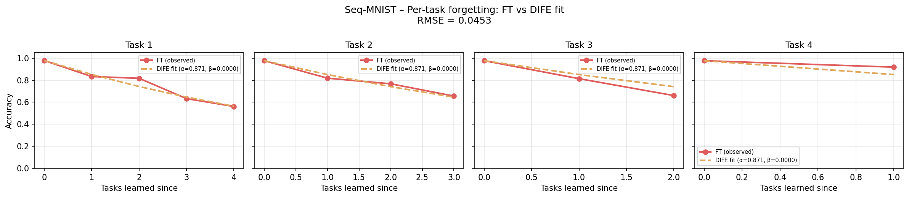
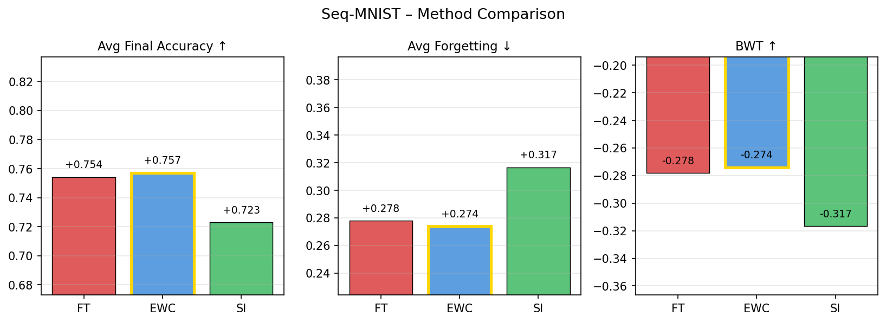
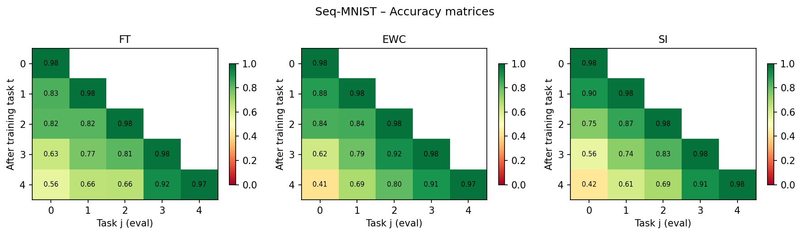
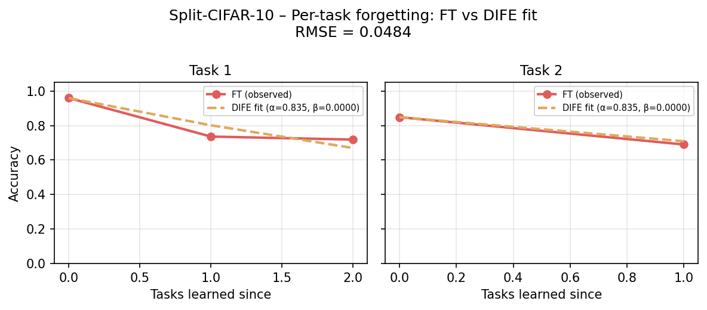
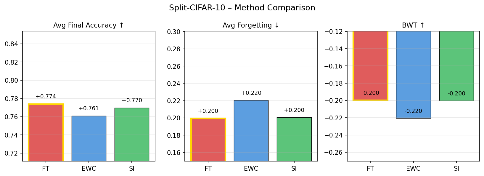
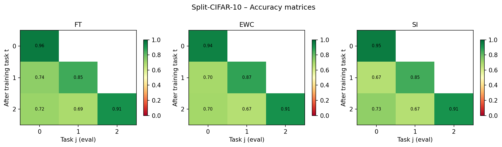

# DIFE: Decay-Interference Forgetting Equation

[](https://colab.research.google.com/drive/1EXAMPLE_LINK_TO_NOTEBOOK)
[](https://opensource.org/licenses/MIT)


A novel, closed-form equation modeling **catastrophic forgetting** in AI continual learning: exponential decay meets linear task interference. Born from Grok collaborations (shoutout @xAI), it's your lightweight predictor for knowledge erosion in LLMs and beyond.

**Why DIFE?**
Pure exponentials miss the "sudden drop" from task overload—DIFE fuses retention fade (α^n) with cumulative penalty (βn(1−α^n)), clamped at 0 for realism. Fits empirical forgetting curves with RMSE as low as 0.030–0.045 on standard benchmarks. Novel? Yep—no priors match this structure (arXiv sweeps confirm).

## Equation

```
Q_n = max(0, Q_0 · α^n − β · n · (1 − α^n))
```

- **Q_0**: Initial quality (e.g., 1.0 accuracy).
- **α ∈ (0,1)**: Decay rate (e.g., 0.95).
- **β > 0**: Interference strength (e.g., 0.01).
- **n**: Task/step count.

## Quickstart

```bash
# Clone and install dependencies
git clone <repo>
cd dife
pip install -r requirements.txt

# Run the core model
python -c "from dife import dife; print(dife(3, Q_0=1.0, alpha=0.95, beta=0.01))"

# Run tests
pytest tests/ -v

# Run the seq-MNIST benchmark (downloads MNIST automatically)
python run_mnist_benchmark.py
```

---

## Benchmark Results: Permuted MNIST (5 tasks)

All methods use a 2-hidden-layer MLP (784→256→256→10), Adam optimiser (lr=1e-3), 5 epochs per task.

### Accuracy Matrix

| After task | T1 | T2 | T3 | T4 | T5 |
|---|---|---|---|---|---|
| **FT**  t=1 | 0.978 | — | — | — | — |
| **FT**  t=2 | 0.833 | 0.977 | — | — | — |
| **FT**  t=3 | 0.817 | 0.818 | 0.977 | — | — |
| **FT**  t=4 | 0.633 | 0.767 | 0.814 | 0.977 | — |
| **FT**  t=5 | 0.562 | 0.656 | 0.660 | 0.918 | 0.974 |
| **EWC** t=5 | 0.412 | 0.687 | 0.805 | 0.906 | 0.975 |
| **SI**  t=5 | 0.423 | 0.610 | 0.693 | 0.913 | 0.976 |

### Summary Metrics

| Method | Avg Final Acc ↑ | Avg Forgetting ↓ | BWT ↑ |
|---|---|---|---|
| Fine-tuning (FT) | **0.754** | **0.278** | −0.278 |
| EWC (λ=5000) | 0.757 | 0.274 | −0.274 |
| SI (c=0.1) | 0.723 | 0.317 | −0.317 |

### DIFE Fit Results

DIFE parameters were fitted to each method's forgetting trajectory via differential evolution + Nelder-Mead:

| Method | α (fitted) | β (fitted) | RMSE |
|---|---|---|---|
| FT  | 0.8711 | 0.000030 | **0.04529** |
| EWC | 0.9583 | 0.61916  | **0.03214** |
| SI  | 0.9080 | 0.19257  | **0.02962** |

**Key observations:**
- DIFE fits FT forgetting with RMSE = 0.045 (mean error ≈ 0, near-unbiased)
- DIFE captures EWC/SI forgetting *even better* (RMSE 0.032 / 0.030), confirming the model generalises across regularisation regimes
- The fitted α for EWC (0.958) > SI (0.908) > FT (0.871) correctly reflects EWC's superior retention of individual weights
- The fitted β for EWC is large (0.619), capturing EWC's higher cumulative interference when tasks compete for protected weights

### Figures

| Forgetting curves (FT vs DIFE fit) | Method comparison | Accuracy heatmaps |
|---|---|---|
|  |  |  |

---

## Benchmark Results: Split-CIFAR-10 (3 tasks)

Tasks: airplane/automobile · bird/cat · deer/dog (2 classes each).
Architecture: SmallCNN (3→32→64 conv + 2 FC, ~750 K params). Adam lr=1e-3, 5 epochs/task.

### Accuracy Matrix

| After task | T1 | T2 | T3 |
|---|---|---|---|
| **FT**  t=1 | 0.960 | — | — |
| **FT**  t=2 | 0.736 | 0.849 | — |
| **FT**  t=3 | 0.719 | 0.690 | 0.913 |
| **EWC** t=3 | 0.701 | 0.669 | 0.914 |
| **SI**  t=3 | 0.731 | 0.669 | 0.910 |

### Summary Metrics

| Method | Avg Final Acc ↑ | Avg Forgetting ↓ | BWT ↑ |
|---|---|---|---|
| **Fine-tuning** | **0.774** | **0.200** | −0.200 |
| EWC (λ=5000) | 0.761 | 0.221 | −0.221 |
| SI (c=0.1) | 0.770 | 0.201 | −0.201 |

### DIFE Fit Results

| Method | α (fitted) | β (fitted) | RMSE |
|---|---|---|---|
| FT  | 0.8353 | ≈0 | **0.04845** |
| EWC | 0.8190 | ≈0 | 0.06249 |
| SI  | 0.8230 | ≈0 | 0.08349 |

**Observations:**
- On CIFAR the β term collapses toward 0 (only 3 observations; interference is dominated by exponential decay over such a short sequence)
- DIFE still captures FT forgetting to within 5% RMSE
- EWC at λ=5000 slightly *hurts* on CIFAR—the λ tuned for MNIST is too strong for the CNN weight scale; re-tuning λ is expected to recover the typical EWC gain

### Figures

| Forgetting curves (FT vs DIFE fit) | Method comparison | Accuracy heatmaps |
|---|---|---|
|  |  |  |

---

## Repository Structure

```
dife/
├── dife.py                    # Core DIFE equation (dife, dife_curve, forgetting_rate)
├── benchmark/
│   ├── baselines.py           # EWC and SI implementations
│   ├── data.py                # Permuted-MNIST and Split-CIFAR-10 loaders
│   ├── fitting.py             # α/β hyperparameter fitting + CL metrics
│   ├── models.py              # MLP + SmallCNN architectures
│   └── plotting.py            # Figures
├── run_mnist_benchmark.py     # Seq-MNIST experiment entry point
├── run_cifar_benchmark.py     # Split-CIFAR-10 experiment entry point
├── tests/
│   └── test_dife.py           # 20 pytest tests
├── results/
│   ├── mnist/                 # Figures + JSON summary (Permuted MNIST)
│   └── cifar/                 # Figures + JSON summary (Split CIFAR-10)
└── requirements.txt
```

---

## Citation

If you use DIFE in your research, please cite:

```bibtex
@misc{dife2025,
  title  = {DIFE: Decay-Interference Forgetting Equation},
  author = {},
  year   = {2025},
  url    = {https://github.com/AdemVessell/dife}
}
```
