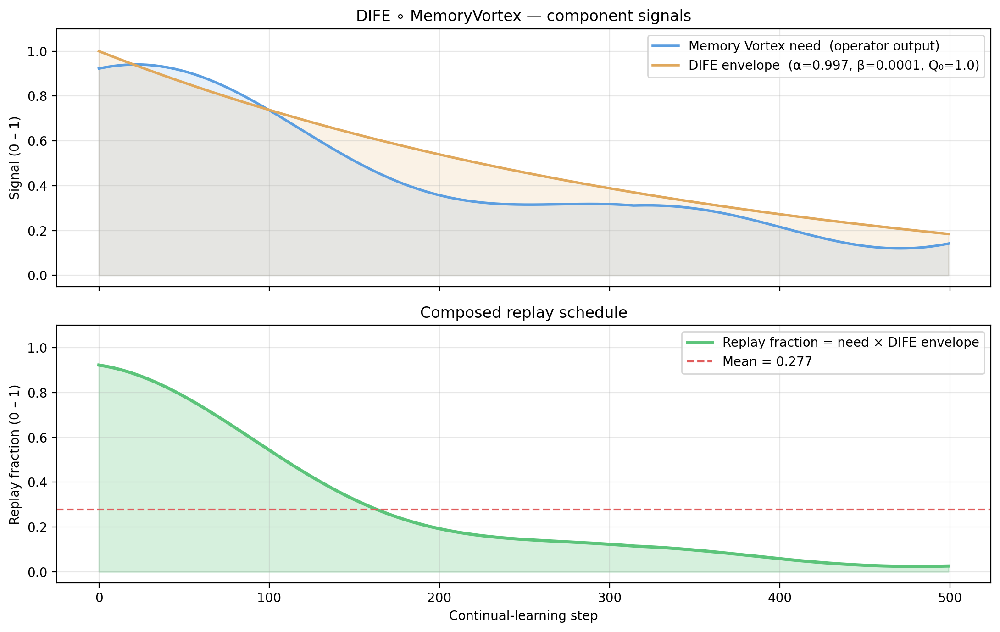

# memory-vortex-dife-lab

**A lab environment combining the [DIFE forgetting equation](https://github.com/AdemVessell/dife) with the [Memory Vortex](https://github.com/AdemVessell/memory-vortex) replay scheduler.**

---

## What is this?

| Component | Source repo | Role |
|---|---|---|
| **DIFE** | `AdemVessell/dife` | Closed-form forgetting model: Q_n = max(0, Q₀·αⁿ − β·n·(1−αⁿ)) |
| **Memory Vortex** | `AdemVessell/memory-vortex` | Symbolic replay-need operator discovered via ridge regression on 7 basis functions |
| **Combined controller** | this repo | Composes both: `replay = need(step) × DIFE_envelope(step)` |

The Memory Vortex asks *"how much replay is structurally needed right now?"*
DIFE asks *"how much of the original quality budget remains under forgetting?"*
Their product is the **actual replay fraction** served to the continual learner.

---

## Architecture

```
      step n
        │
        ▼
┌───────────────────┐        ┌────────────────────┐
│  Memory Vortex    │        │    DIFE envelope    │
│  operator(step)   │        │  max(0, Q₀αⁿ−βn(1−αⁿ)) │
│  ∈ [0, 1]         │        │  ∈ [0, 1]          │
└────────┬──────────┘        └─────────┬──────────┘
         │                             │
         └─────────── × ───────────────┘
                       │
                       ▼
              replay_fraction(step) ∈ [0, 1]
               → {"vision": r, "text": r, "audio": r}
```

---

## Quickstart

```bash
# Install deps
pip install -r requirements.txt

# 1. Generate the operator JSON from DIFE forgetting dynamics
python scripts/generate_operator.py

# 2. Run the controller demo (produces dife_memory_vortex_demo.png)
python scripts/run_controller_demo.py

# 3. Run tests
pytest tests/ -v
```

---

## Repository structure

```
memory-vortex-dife-lab/
├── dife/
│   ├── __init__.py        re-exports dife(), dife_curve(), forgetting_rate()
│   ├── core.py            DIFE equation (from AdemVessell/dife)
│   └── controller.py      MemoryVortexOperator · DIFEParams · DIFE_MemoryVortexController
├── memory_vortex/
│   ├── basis.py           7-function basis: sin(t), cos(t), …
│   ├── discovery.py       GCADiscoveryEngineV1 (ridge regression, from AdemVessell/memory-vortex)
│   └── scheduler.py       MemoryVortexScheduler (JSON loader + fallback)
├── operators/
│   └── memory_vortex_operator.json   (generated by scripts/generate_operator.py)
├── scripts/
│   ├── generate_operator.py          Fit operator from DIFE-derived replay-need signal
│   └── run_controller_demo.py        Plot need / envelope / replay over 500 steps
├── tests/
│   └── test_controller.py            25 pytest unit tests
├── requirements.txt
└── README.md
```

---

## The DIFE equation

```
Q_n = max(0, Q_0 · α^n  −  β · n · (1 − α^n))
```

| Parameter | Meaning | Typical value |
|---|---|---|
| Q_0 | Initial quality / replay budget | 1.0 |
| α   | Per-step retention rate | 0.95 – 0.99 |
| β   | Interference accumulation rate | 0.001 – 0.02 |
| n   | Steps since task was learned | 0, 1, 2, … |

---

## The Memory Vortex basis

The operator is a linear combination of 7 fixed basis functions:

| # | Basis | Role |
|---|---|---|
| 0 | sin(t) | periodic component |
| 1 | cos(t) | periodic component |
| 2 | sin(2t) | higher-frequency oscillation |
| 3 | cos(2t) | higher-frequency oscillation |
| 4 | exp(−0.1t) | exponential decay |
| 5 | t | linear trend |
| 6 | log(1+|sin(t)|) | log-modulated periodic |

where `t = step / t_scale` (default t_scale = 100).

The `GCADiscoveryEngineV1` fits coefficients by ridge regression with λ selected
on a blocked validation split. The result is saved as `operators/memory_vortex_operator.json`.

---

## Using the controller in code

```python
from dife.controller import MemoryVortexOperator, DIFEParams, DIFE_MemoryVortexController

op   = MemoryVortexOperator.from_json("operators/memory_vortex_operator.json")
p    = DIFEParams(Q0=1.0, alpha=0.985, beta=0.004)
ctrl = DIFE_MemoryVortexController(op=op, dife_params=p)

for step in range(500):
    r = ctrl.replay_fraction(step)          # scalar ∈ [0, 1]
    d = ctrl.per_modality(step)             # {"vision": r, "text": r, "audio": r}
    b = ctrl.breakdown(step)               # {"need": …, "envelope": …, "product": …}
```

---

## Demo output

After running `python scripts/run_controller_demo.py`:



- **Top panel**: Memory Vortex need signal (blue) and DIFE envelope (orange)
- **Bottom panel**: Composed replay fraction = need × envelope (green), with dashed mean line

---

## Citation

```bibtex
@misc{memory_vortex_dife_lab_2025,
  title  = {memory-vortex-dife-lab: Combining DIFE and Memory Vortex for adaptive CL replay},
  author = {AdemVessell},
  year   = {2025},
  url    = {https://github.com/AdemVessell/memory-vortex-dife-lab}
}
```
